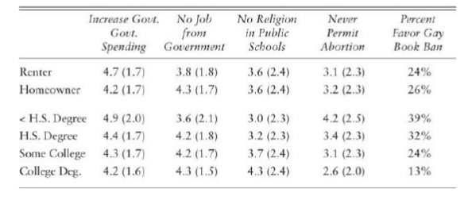

\fontsize{12}{22}
\selectfont

```{r setup, include=FALSE}
knitr::opts_chunk$set(echo = FALSE)
library(ggplot2)
library(dplyr)
library(tidyr)
library(xtable)
library(scales)
library(infer)
library(RColorBrewer)
library(patchwork)
load("../data/survey.RData")
load("../data/p_vals.RData")
load("../plots/j_tab_2.2.RData")
not_na <- function(vec) !(is.na(vec))
ends <- function(vec) c(vec[1], vec[length(vec)])
```

# Introduction

A previous paper written for POL 362 detailed issues with some of the methods used in J. Eric Oliver's *Local Elections and the Politics of Small-Scale Democracy* [@oliver12], and proposed some alternative methodology that could address these issues. This paper seeks to implement some recommendations for better data usage and more relevant variable choice in analysis to better understand "Who Votes in Local Elections" [@oliver12, Ch. 2]. The three main characteristics at issue in the earlier paper are as follows:

1. Oliver's motivating observation is that people rationalize their decisions about local elections differently than they do in national elections, but uses two well-known national voting models^[These are retrospective voting and issue-based voting. [@retro] and [@issue] define these models well, respectively.] to explain local vote choice. A better question might be "what issues and performance factors do local voters consider when evaluating incumbents?"

2. The three factors Oliver uses to distinguish local from non-local jurisdictions are size, scope, and bias, which he then uses as independent variables to predict electoral phenomena in local versus non-local elections. Bias, however, is significantly endogenous to electoral results, as a new administration can very quickly change resource collection and distribution. This makes it a less than ideal factor to use in predicting simplistic relationships among different types of elections.

3. In Chapter 2, "Who Votes in Local Elections?", Oliver concludes that local voters are a representative sample of local non-voters, thus dismissing any potential problems relating to low voter turnout in local elections. His evidence for this reasoning, however, rests on distinctly non-local issues such as abortion and government-provided jobs. A better underpinning for such a conclusion might examine a more local set of issues like property taxes or utility provision.

Here the focus will be on the claims presented in 1 and 3, and perform some other assorted analyses. There are two heavy claims explored in the book: the first that local voters are substantially different from national voters, and the second that local voters are not substantially different from local non-voters. Part of the weight of these claims is due to their status as a novel application of voting behavior research to local (rather than national) elections, and part is due to their their departure from recent scholarship^[And to some extent, "common political sense" [@whovotesnow, p. 156].] on voter turnout, local elections, and the behavior of American voters. Contemporary works generally concludes that national voters and non-voters differ in both demographic qualities and policy preferences. Such heavy claims require substantial evidence supporting them, however, which is where Oliver's work falls short.

# Background

## National voting habits

To start, the term "non-voter" is hard to rigorously define. Pew Research Center has identified at least 6 types of non-regular voters in the last twelve years:

* Intermittent voters, who are registered but "report less certainty of voting in the upcoming election and less interest in the campaign" [@whovotespew]

* Registered but rare voters, who "acknowledge that they rarely make it to the polls" [@whovotespew]

* Unregistered adults, who are not registered at all [@whovotespew]

* Drop-off voters, "who voted in the 2012 and 2016 presidential elections but not the 2014 midterm" [@dropoff]. This could generally extrapolate to presidential-year voters.

* Nonvoters, who are "registered to vote, but did not cast ballots in any of the most recent national elections" as of 2017 [@dropoff]

* Nonvoters, "those who are either not registered to vote or are considered unlikely to vote in the upcoming midterms" [@party_nonvoter]

These last three types come from articles written after (and separately from) the article identifying the first three types, so there may be some overlap in the definition of these different groups. This should illustrate that even within the same research group, characteristics chosen to define a "non-voter" are inconsistent. This phenomenon, possibly a result of generally inconsistent data availability, makes comparisons between different studies quite difficult. While they differ in exact numbers due to their definitions, the above sources agree on some common trends. Demographically, non-voters tend to lean more Democratic^[Despite a higher proportion of non-voters reporting that they lean slightly more Democratic than the nation at large, they have notably weak party ties overall and a "a plurality of nonvoters are independents" [@nonvoters]. Other research into party primaries discusses how this relative moderateness of non-voters can further depress primary turnout and lead to higher political polarization [@brookings].], younger, less affluent, less educated, more racially and ethnically diverse, and less religious than voters. They trust the government (and other people in general) less than regular voters, and don't consider who wins the presidential election particularly important (or their specific House of Representatives election, even more so). On policy issues, non-voters think the government should do more than voters think it should, and they are less likely to support a universal taxcut and repealing Obamacare than voters [@whovotespew; @nonvoters; @party_nonvoter; @dropoff].

Some other, non-Pew research has been conducted to determine how voters differ from non-voters, especially on policy issues. Wolfinger and Rosenstone's 1980 *Who Votes?* concludes that demographic differences between voters and nonvoters "do not translate into discernible overrepresentation of particular policy constituencies" [@whovotes, p. 111]. Such policy differences do exist, but only in small amounts, and in both a liberal and conservative direction on different issues. Shaffer, writing in 1982, finds that while voters exhibited more conservative bias than non-voters until the late 1960s, but no significant difference between the two groups existed by the time of writing [@shaffer]. More recently, a 2015 Demos study found that on a set of policy issues including paid sick leave, raising the minimum wage, and government regulation, "non-registered people were more progressive than registered people" [@demos]. Leighley and Nagler's 2013 *Who Votes Now?*^[A follow-up to the aforementioned *Who Votes?* [@whovotes]] finds that "there are notable, consistent and substantial differences between voters and nonvoters on redistributive issues," those dealing with governmental actions that redistribute resources to the poor, and in a conservative direction [@whovotesnow, p. 165]. They also observe no significant or consistent difference in 2004 on policy preferences on social issues or national security and military issues, with the exception of "support for keeping troops in Iraq or bringing them home", with a 15-point spread towards "voters preferring that the troops stay in Iraq" [@whovotesnow, p. 175]. The distinction between this analysis and Wolfinger and Rosenstone's is that by breaking out redistributive issues specifically, Leighley and Nagler were able to identify a coherent policy subset in which voters are distinctly non-representative of non-voters, going back even to 1972 with the original study's data. In general, early research on the subject indicated a relatively small policy gap between voters and non-voters, but more contemporary studies show that "voters in national elections are more likely to be Republican and to oppose redistributive social policies than non-voters" [@mit].

## Low turnout and local elections

The study of local elections as a field is notably unexplored compared to national or state elections. A quick search engine query for "local voting research" reveals the major result in the field: voter turnout in American local elections is stunningly low. A Portland State University project summarizes that in only 8 of the 30 biggest American cities does mayoral election turnout in the 2011-2015 cycle surpass 30%, and in only 1 (Portland) does it surpass half [@mayor]. Texas's large cities are particularly lacking in this regard, with Houston topping out at 18% followed by Austin, El Paso, San Antonio, Fort Worth, and Dallas, at (respectively) 13%, 12%, 11%, 6%, and 6%^[Texas, breaking my heart, falls notably behind other states in voter turnout in almost all levels of elections [@tribune].]. Low turnout may matter more in local elections than national elections because of the varying demographic makeup of local communities. While Asian Americans are only 5% of the U.S. population, they make up about a third of the populations of San Francisco and San Jose, so depressed minority turnout there has significantly more leverage on electoral results than on a national level [@wapo]. Particularly in local elections, Hajnal and Trounstine argue that "Higher voter turnout is associated with spending patterns that more closely reflect the preferences of minorities and lower class voters" [@hajnal].

# Reproducing results

We begin our analysis by trying to recreate Oliver's results, to better approximate his methods and as a check to ensure similarity when proposing changes. Unfortunately, no variable for "town population" exists in the 1990 American Citizen Participation Study (ACPS) that Oliver draws most of the results in this study from [@acps], so some data joins were necessary to combine census data with the ZIP code information from the ACPS to achieve a measure of community size. These joins are a potential source of error in the conclusions presented here, as not all relevant data from 1990 was available and some more modern sources (such as a file matching ZIP codes to ZIP Code Tabulation Areas used in the 2010 census) had to be substituted [@zip_to_zcta]. While these match in general, there are cases of ZIP code boundaries changing since 1990 and even some ZIP codes being eliminated since then. In addition, since ZIP codes cross political boundaries, any given ZIP code has multiple towns (and thus potential population measures) that fall within it. To decide which subjects lived in "small towns"^["A community under 100,000 in size", by Oliver's definition [@oliver12, p. 3].], we took the population of a subject's town to be that of the largest town (census-designated place, in the data) with land inside the boundary of the subject's reported ZIP code [@census]. This almost certainly led to an undersampling of the subjects Oliver used for his analysis.^[An attempt was made to directly contact the author and obtain the subset of data used originally, but he did not respond before the deadline.] Code used to perform these joins and (some) data can be found [online](https://github.com/jayleetx/state_local_final)^[https://github.com/jayleetx/state_local_final]. With all of this in mind^[In addition (full disclosure), I haven't figured out yet how to properly work with survey weights in R, and there wasn't enough time before the paper deadline for me to learn that, so all results are presented unweighted by gender.], these results should be considered as proof of concept rather than fully explanatory conclusions. Recreations of some of the graphs and tables in Chapter 2 follow.

```{r, out.width="0.5\\textwidth"}
knitr::include_graphics(c("../plots/fig_2.1.png", "../plots/j_fig_2.1.png"))
```

\begin{center}
\textit{Recreation of Figure 2.1} \cite[p.~69]{oliver12}

\hrulefill
\end{center}

```{r, out.width="0.5\\textwidth"}
knitr::include_graphics(c("../plots/fig_2.2.png", "../plots/j_fig_2.2.png"))
```

\begin{center}
\textit{Recreation of Figure 2.2} \cite[p.~71]{oliver12}

\hrulefill
\end{center}

```{r, out.width="0.5\\textwidth"}
knitr::include_graphics(c("../plots/fig_2.3.png", "../plots/j_fig_2.3.png"))
```

\begin{center}
\textit{Recreation of Figure 2.3} \cite[p.~73]{oliver12}

\hrulefill
\end{center}

```{r, out.width="0.5\\textwidth"}
knitr::include_graphics(c("../plots/fig_2.5.png", "../plots/j_fig_2.5.png"))
```

\begin{center}
\textit{Recreation of Figure 2.5} \cite[p.~78]{oliver12}

\hrulefill
\end{center}

```{r, out.width = "\\textwidth", results = "asis"}


print(xtable(j_tab_2.2), include.rownames = FALSE, booktabs = TRUE, type = "latex", comment = FALSE, scalebox='0.9')
```

\begin{center}
\textit{Recreation of Table 2.2. Higher scores in each column represent agreeing more with the statement.} \cite[p.~81]{oliver12}
\end{center}

Each recreation has some difference from Oliver's originals, but overall the same notable patterns appear. The recreation of Figures 2.1 and 2.2 maintain that homeownership is on par with education and age for explaining individual voter turnout, if not "larger than age" as a factor as in Oliver's analysis [@oliver12, p. 70]. This will be quantified later. Recreating Figure 2.3 continues to show a larger difference among educational level rather than home ownership in local political interest. Also maintained is the phenomenon that "among renters, education correlates quite strongly with political interest" where the relationship is not quite so strong among homeowners [@oliver12, p. 74].

# Alternative methodology: suggestions and implementation

The issues taken with Oliver's work in Chapter 2 are threefold. First, the variables he chooses to see if homeowners look like renters aren't very local issues. Second, after spending a whole framework distinguishing how voters are *not* a random sample of the population (they are overwhelmingly homeowners and more educated), he claims that voters do in fact look like non-voters. Third, he makes two jumps to get from voting habits to home ownership & education to issue positions, but it would have been more direct and explanatory to go straight from voting habits to issue positions. The ACPS, unfortunately, only asks about non-local issues, with the possible exception of some local free speech issues such as book bans and who should be allowed to give public speeches in town. These deal with more overarching national political debates, however, and shouldn't be considered "local" issues in the same way that educational performance and road maintenance are. Later work should be conducted with regards to differences in opinion on more definitively local issues. Potential local issues could include bike and pedestrian infrastructure, park or greenspace creation and maintenance, and "main street" revival efforts. With insufficient data to address the first issue, the focus here will be on comparing the demographic qualities of local voters and nonvoters and directly analyzing the relationship between local voting habits and issue preferences. These suggestions are implemented here below.

## Demographic differences between voters and nonvoters

Previous research has detailed the general demographic unrepresentativeness of voters compared to the general population. This on its own should be concerning for democratic validity, as underrepresented constituencies with distinct needs and preferences are not being heard through the process of voting, and "decisions are being made without
input from a representative sample of residents" [@usvote]. With the demographic variables from the ACPS, it is possible to compare how self-reported regular voters differ from non-regular voters on different demographic variables.

\hrulefill

```{r}
edu_plot <- survey %>%
  filter(not_na(local_vote_reg), not_na(education)) %>%
  ggplot(aes(x = local_vote_reg, fill = education)) +
    geom_bar(position = "fill") +
    scale_fill_brewer(palette="Blues") +
    scale_y_continuous(labels=percent) +
    labs(x = "", y = "", fill = "Education level") +
    theme(axis.text.x = element_text(angle = 30, hjust = 1))

age_plot <- survey %>%
  filter(not_na(local_vote_reg), not_na(age)) %>%
  ggplot(aes(x = local_vote_reg, fill = age)) +
    geom_bar(position = "fill") +
    scale_fill_brewer(palette="Greens") +
    scale_y_continuous(labels=percent) +
    labs(x = "", y = "", fill = "Age group") +
    theme(axis.text.x = element_text(angle = 30, hjust = 1))

income_plot <- survey %>%
  filter(not_na(local_vote_reg), not_na(income)) %>%
  ggplot(aes(x = local_vote_reg, fill = income)) +
    geom_bar(position = "fill") +
    scale_fill_brewer(palette="Reds") +
    scale_y_continuous(labels=percent) +
    labs(x = "", y = "", fill = "Income bracket") +
    theme(axis.text.x = element_text(angle = 30, hjust = 1))

race_plot <- survey %>%
  filter(not_na(local_vote_reg), !(race %in% c("other", NA, "don't know"))) %>%
  ggplot(aes(x = local_vote_reg, fill = race)) +
    geom_bar(position = "fill") +
    scale_fill_brewer(palette="Purples") +
    scale_y_continuous(labels=percent) +
    labs(x = "", y = "", fill = "Race") +
    theme(axis.text.x = element_text(angle = 30, hjust = 1))

edu_plot + age_plot + income_plot + race_plot + plot_layout(ncol = 2)
```

\begin{center}
\textit{Comparison of demographic characteristics between regular voters and non-regular voters}

\hrulefill
\end{center}

The ACPS data tells a familiar story, in line with previous research on national voters. Regular local voters are more educated, older, wealthier, and less diverse than non-regular voters. We should expect to see policies tilt in a more conservative direction as such, as the groups overrepresented among voters tend to have more conservative policy preferences (with the possible exception of education).

## Direct link between voting habits and issue preferences

Since the ACPS has respondent-level data on local voting habits and issue preferences, a direct comparison is possible to see whether local voters look like non-local voters on various issues. A similar table to Oliver's Table 2.2 is presented below.

```{r results = "asis"}
table_summary <- function(x) {
  mean <- round(mean(x, na.rm = TRUE), 1)
  sd <- round(sd(x, na.rm = TRUE), 1)
  paste0(mean, " (", sd, ")")
}
voting_issues <- survey %>%
  group_by(local_vote_reg) %>%
  summarize(gov_spending = table_summary(gov_spending),
            gov_jobs = table_summary(gov_jobs),
            school_prayer = table_summary(school_prayer),
            abortion = table_summary(abortion),
            gay_book_ban = percent(round(mean(gay_book_ban == "YES", na.rm = TRUE), 2))) %>%
  arrange(local_vote_reg)
voting_issues <- voting_issues[complete.cases(voting_issues), ]
colnames(voting_issues) <- c("Voting Habit",
                             "Govt. Spending",
                             "No Govt. Job",
                             "No Religion in Public K-12",
                             "No Abortion",
                             "Gay Book Ban")

print(xtable(voting_issues), include.rownames = FALSE, booktabs = TRUE, type = "latex", comment = FALSE, scalebox='0.9')
```

\begin{center}
\textit{Comparison of issue preferences with voting habits}
\end{center}

The table shows that regular voters are more conservative than non-regular voters on redistributive issues, expressing more preference for a decrease in government spending and no guaranteed government job. On social issues, however, there are closer margins and higher standard deviations, indicating that voters and non-voters are closer together on social issues than economic issues. The results here seem to match those presented by previous research on national-level voters: per Pew, non-voters are more liberal "on a wide range of domestic and foreign policy issues", but "the differences are far less pronounced on social issues, like gay marriage and abortion" [@nonvoters]. These differences do not appear to be statistically significant, but they are no less so than Oliver's results in his Table 2.2 [@oliver12, p. 81]. The relative magnitude of these differences can be quantified with permutation tests for difference in proportions (for the gay book ban question) and means (for the other scaled issues).

```{r results = "asis"}
p_vals <- round(p_vals, 3)
row.names(p_vals) <- c("Home ownership", "Education level", "Voting habit")
colnames(p_vals) <- c("Govt. Spending",
                      "No Govt. Job",
                      "No Religion in Public K-12",
                      "No Abortion",
                      "Gay Book Ban")
print(xtable(p_vals), include.rownames = TRUE, booktabs = TRUE, type = "latex", comment = FALSE, scalebox='0.9')
```

\begin{center}
\textit{$p$-values of comparative t-tests}
\end{center}

Each column of the above table is an issue question as used by Oliver, and of interest is whether each row variable contains differences in opinion on these issues. This is examined through a permutation test (a hypothesis test with an empirically generated distribution) for each pair of explanatory variable and issue for a difference in means/proportions between the highest (home ownership, college degree, regular voting) and lowest (renting, less than H.S. degree, non-regular voting) categories of each row variable, and the two-sided $p$-values for each test are presented in the cells of the table. For example, the cell in the 2nd row and 4th column represents the $p$-value from a permutation test for difference in mean opinion score on the prayer in school question between respondents with a college degree and respondents who didn't finish high school. The empirical nature of the permutation test leads to appearances of $p$-values equal to 0 when none should exist^[The permutation tests implemented are examples of Monte Carlo methods, which utilize finite approximations of infinite distributions. In this particular case, the null distribution is generated by repeatedly reassigning one variable to different respondents, which can only lead to a finitely generated set of permutations. This sometimes produces $p$-values of 0, when the arrangement of the data encountered is "as extreme" as anything in the generated set of rearrangements of it [@p_val, p. 6].], so a standard correction was applied to raise all $p$-values by 0.001. A $p$-value less than 0.05 represents a statistically significant (at the standard $\alpha = 0.05$) difference in opinion between the 2 extreme groups.

The results here seem to match some of the national voting habits literature discussed earlier. On redistributive issues, there exist significant differences in policy preferences between voters and nonvoters, the highly educated and less educated, and homeowners and renters. On social issues there appears to be less of a difference, but education level is still a highly significant factor in differentiating policy preferences, at least moving between the two extremes.

## Variable importance: do local voters turn out for different reasons than national voters?

Oliver performs a rather fast-and-loose assessment of variable importance throughout the chapter to determine to what amount different variables affect individual local voter turnout. His method is to analyze the aggregated change in regular voting rates when moving between different levels of each explanatory variable [Figure 2.1, Oliver 69]. Another method of determining variable importance is to compare performance among each variable in predicting whether a given person will vote regularly or not. A logistic regression is a good fit for making this sort of prediction. One potential measure of assessing "importance" is the Akaike information criterion (AIC), which is a measure of how much information is lost when we abstract away from using the data to using the model. Less information loss means the model describes the data better, so whichever variable has a model with the lowest AIC will be the most important by this criterion.

Another criterion to compare variable importance is the "coefficient spread" of each variable, the predicted difference in the probability of voting^[The values presented are not exactly the magnitudes of changes in predicted probability of voting, due to the nature of the function used to interpret the logistic regression. Direction is maintained by this function, however, so a positive "slope" coefficient represents a higher predicted probability of voting given a change to that variable level. Additionally, if variable $A$ has a higher absolute coefficient than variable $B$, a change in variable $A$ will have more impact on the predicted probability of voting than an equivalent change in variable $B$.] as an observation moves between levels of a variable. Since two of our explanatory variables are ordered (education and age) and the other is a binary option (home ownership), we can compare which variables produce the highest change in predicted probabilities of voting regularly as you move from the lowest level to the highest. The results of both of these methods are as follows.

```{r, results = "asis"}
logit <- glm(local_vote_reg ~ home_status + education + age + yrs_in_town, data = survey, family = "binomial")

print(xtable(coef(summary(logit))), include.rownames = TRUE, booktabs = TRUE, type = "latex", comment = FALSE)
```

\begin{center}
\textit{Summary of multiple logistic regression for regular voting}

\hrulefill
\end{center}

```{r, results = "asis"}
max_vars <- abs(logit$coefficients[c("home_statusRenter", "educationCollege degree", "ageAge 65+", "yrs_in_town20+ years in town")])
p_vals <- coef(summary(logit))[c("home_statusRenter", "educationCollege degree", "ageAge 65+", "yrs_in_town20+ years in town"),4]

home_logit <- glm(local_vote_reg ~ home_status, data = survey, family = "binomial")
edu_logit <- glm(local_vote_reg ~ education, data = survey, family = "binomial")
age_logit <- glm(local_vote_reg ~ age, data = survey, family = "binomial")
res_logit <- glm(local_vote_reg ~ yrs_in_town, data = survey, family = "binomial")

aics <- c("home_status" = home_logit$aic, "education" = edu_logit$aic, "age" = age_logit$aic, "res" = res_logit$aic)

table <- data.frame(Variable =  c("Home ownership", "Education", "Age", "Years in town"),
                    AIC = aics,
                    Spread = max_vars)

print(xtable(table), include.rownames = FALSE, booktabs = TRUE, type = "latex", comment = FALSE)
```

\begin{center}
\textit{Comparison of variable strength for predicting regular voting}
\end{center}

This assessment presents a similar interpretation of the direction of each variable, and a different interpretation of the strength of the effect of home ownership on local voting than Oliver does. We still see here that home ownership, education, age, and length of residency are all positively associated with regular voting. If a subject were to move from the lowest level of each variable (renting, less than a high school degree, age < 25, < 2 years in town) to the highest level (owning, a college degree, age 65+, 20+ years in town), the predicted change in the probability of a subject voting is markedly less for home ownership than for length of residency than for education or age, while education and age are much closer together. The AIC assessment agrees with this pattern, noting that home ownership is a less effective predictor of regular voting than education or age. The results for length of residency are mixed: it has the lowest AIC, but a middling absolute effect (variable spread) and lower $p$-values than the other variables.

Theoretically, this analysis suggests that home ownership is a less important predictor of regular voting than education levels or age. National voting research has long held that education and age are extremely useful predictors of voting habits [@whovotes, p. 102], so (contrary to Oliver's conclusion) it might be true that local voters are quite similar to national voters in the factors that cause them to vote or not.

## Factors considered when evaluating incumbents

In addition to what cause people to vote at all, we are interested in what might sway their decision of which candidate to vote for. Given the non-partisan nature of many (if not most) local elections, support for incumbency is one of the best ways to evaluate this. The theory of retrospective voting is better suited for quantitative analysis than than issue-based voting, since building consistent data about which issues influenced an individual's vote is complicated given the incredibly heterogeneous nature of local elections and local issues. Equally as unfortunately as earlier, the ACPS did not ask questions about what voters thought about specifically when evaluating their local election decisions. Some previous literature exists on this topic, however. Regrettably, much of the research on sub-state elections that exists focuses on large urban populations and voting habits. In these environments, literature shows that evaluations for individual electoral decisions often differ based on the powers that the office in question maintains. Hopkins & Pettingill (2017) contend that in urban locales, citizens take compare local unemployment and well-being to other cities and the nation when retroactively evaluating incumbents [@petting]. Lay and Tyburski (2017) find that when mayors (rather than elected school boards) have control over local schools, voters reward the incumbent if test scores are high, particularly when opinions on the public school system are generally positive [@schools]. True to the stereotype of local government, Burnett and Kogan find that city council incumbents who are worse at filling potholes (measured by number of pothole complaints in each council district) are punished at the ballot box by the voters [@potholes].

# Conclusions

Given the caveats mentioned at the start of the replication section, the results found here (and published elsewhere since Oliver's publication in 2012) cast doubt on many of the claims addressed in chapter 2. On the whole, there is little evidence that local voters turn out for different (demographic-based) reasons than national voters; notably home ownership is a much less significant predictor of increased local voting rates than Oliver concludes. His claim that voters are no different in policy preferences from non-voters isn't entirely wrong, but separating redistributive economic policy from social policy reveals a more complex structure to the patterns at play. The low turnout characteristic of local elections appears to be more of a problem than Oliver makes it out to be. In demographic terms alone, an unrepresentative electorate means that underrepresented groups are left unheard by lawmakers and governing bodies. This can lead directly to unwanted policy implementations, as confirmed by the literature in larger city elections. Everything presented here confirms what many working in the field of local election research already know: more research and more consistent data sources are needed to advance the work being done. Since local governments are often the most direct point of contact between a citizen and politics, ensuring they speak for all constituents is one of the best ways to promote good governance and trust in the electoral sytem.

\newpage

# Appendix: Question specifications

Several issue-based questions in the ACPS were referenced earlier. The full text of these questions is reproduced below.

Government spending: Some people feel that the government should provide fewer services, even in areas such as health and education in order to reduce spending.  (Suppose these people are at one end of the scale at point number 1.) Other people feel it is important for the government to provide many more services even if it means an increase in spending.  (Suppose these people are at the other end, at point 7.  And, of course, some other people would have opinions somewhere in between at points 2,3,4,5, and 6.)  Where would you place yourself on this scale?

No government job: Some people feel that the government in Washington should see to it that every person has a job and a good standard of living.  Suppose these people are at one end of the scale at point number 1.  Others think that the government should just let each person get ahead on his or her own.  Suppose these people are at the other end at point 7.  And of course, some other people have opinions somewhere in between at points 2,3,4,5, or 6.  Where would you place yourself on this scale?

No religion in public K-12: Some people think public schools should be allowed to start each day with a prayer.  (Suppose these people are at one end of the scale at point number 1.)  Others feel that religion does not belong in the public schools but should be taken care of by the family and the church.  (Suppose these people are at the other end, at point 7.  And, of course, some other people would have opinions somewhere in between at points 2,3,4,5, and 6.)  Where would you place yourself on this scale?

No abortion: Some people feel that a woman should always be able to obtain an abortion as a matter of personal choice.  (Suppose these people are at one end of the scale at point number 1.)  Others feel that, by law, abortions should never be permitted.  (Suppose these people are at the other end, at point 7.  And, of course, some other people would have opinions somewhere in between at points 2,3,4,5, and 6.)  Where would you place yourself on this scale?

Gay book ban: There are always some people whose ideas are considered bad or dangerous by other people.  Consider someone who is openly homosexual.  If some people in your community suggested that a book he or she wrote in favor of homosexuality should be taken out of your public library, would you favor removing this book or not?

\newpage

# 

\nocite{*}
